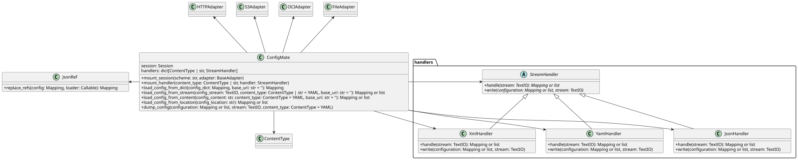

# How the implementation is organized

Config Mate separates configuration transport, serialization, and reference
resolution. The `ConfigMate` class coordinates these responsibilities without
embedding the details of every URI scheme or document format.

## Package layout

The implementation is deliberately small:

```text
src/config_mate/
├── __init__.py
├── main.py
└── handlers/
    ├── __init__.py
    ├── json_handler.py
    ├── xml_handler.py
    └── yaml_handler.py
```

- `config_mate.__init__` defines the `ConfigMate` facade and the load,
  resolution, and dump pipeline.
- `config_mate.main` defines the Click command, configures transport adapters,
  and directs output to a file or standard output.
- `config_mate.handlers` defines the serialization abstraction and the
  built-in JSON, YAML, and XML implementations.
- `session-adapters` supplies the file, S3, OCI, and authenticated HTTP
  transport adapters used by the CLI.
- `jsonref` performs recursive JSON Reference resolution.

The playground is a separate Streamlit consumer of the public `ConfigMate`
API. It is not part of the loading core.

## Class diagram

The diagram shows the core collaboration points. `ConfigMate` owns the
requests session and handler registry, delegates resource access to session
adapters, delegates parsing and writing to stream handlers, and invokes
`jsonref` for `$ref` replacement.

[](../diagrams/class_diagram.svg)

The generated SVG is based on the [PlantUML
source](../diagrams/src/class_diagram.puml). The diagram focuses on
architectural relationships; external library classes are shown only where
they connect to the Config Mate core.

## The loading pipeline

All input paths converge on the same pipeline:

```text
location or content
        │
        ▼
select transport and obtain a text stream
        │
        ▼
select a handler from the content type
        │
        ▼
parse JSON, YAML, or XML into Python values
        │
        ▼
resolve $ref recursively with jsonref
        │
        ▼
return plain mappings, or a list for multiple documents
```

`load_config_from_location()` distinguishes a URI from a local filesystem
path. Local paths are converted to absolute `file://` URIs, so both local and
remote resources pass through the requests session. The response content type
selects a stream handler. Gzip response bodies are detected from their magic
bytes and decompressed before parsing.

The parsed value then reaches `load_config_from_dict()`, which calls
`jsonref.replace_refs()`. Config Mate supplies `load_config_from_location()` as
the loader, allowing a reference discovered by `jsonref` to re-enter the same
transport and parsing pipeline. This is what makes references recursive across
different documents and schemes.

Reference proxies and lazy loading are disabled. Callers receive ordinary
Python mappings rather than values that fetch content when later accessed or
represented.

## Transport adapters

`requests.Session` is the transport registry. The CLI mounts one adapter for
each supported scheme:

| Scheme | Adapter |
| --- | --- |
| `http://`, `https://` | `HTTPAdapter` or `BearerAuthHTTPAdapter` |
| `file://` | `FileAdapter` |
| `s3://` | `S3Adapter` |
| `oci://` | `OCIAdapter` |

Both the root document and any external references use the same session.
Consequently, HTTP bearer authentication and OCI configuration supplied to
the CLI also apply while collecting referenced resources.

The public `mount_session()` method makes transport support extensible. A
caller using the Python API can associate another URI scheme with any
compatible `requests` adapter.

## Serialization handlers

`StreamHandler` defines two operations:

- `handle()` parses a text stream into mappings; and
- `write()` serializes mappings to a text stream.

`ConfigMate` registers handlers by content type. Several MIME types can point
to the same handler—for example, standard JSON and problem JSON use
`JsonHandler`, while plain text is treated as YAML to support services that
serve YAML without a specific YAML content type.

The public `mount_handler()` method accepts either a `ContentType` or a string,
so applications can register another MIME type or replace a built-in
serialization strategy without changing the resolution pipeline.

## Entrypoints

The CLI is a thin composition layer. It:

1. translates `--ext` into an output content type;
2. creates `ConfigMate`;
3. mounts the standard transport adapters and credentials;
4. loads and resolves the root location; and
5. dumps the result to standard output or `--output`.

The playground follows the same shape but starts from editor content, calls
`load_config_from_content()`, and renders the YAML result in Streamlit. Keeping
these entrypoints outside the core lets the same API serve automation,
interactive exploration, and direct Python integrations.
